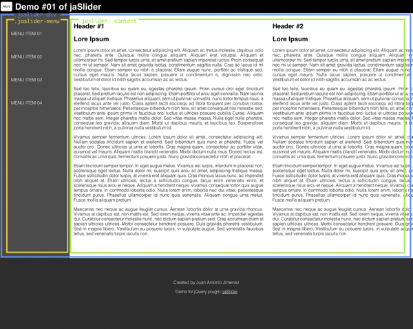

jaSlider
========


## Introduction

jQuery plugin to create a slider menu on your website. To create this plugin was used the following: 

* HTML5 & CSS3
* [jQuery](http://jquery.com/)
* [Coffeescript](http://coffeescript.org/)

## Instalation

To use jaSlider you have to include jaSlider javascript and css stylesheet files to your projects:

* jaSlider.js / jaSlider.min.js
* jaSlider.css / jaSlider.min.css

## How to use

To use jaSlider, your html code have to look like this:

```
<body>
…
	<div class="jaslider-div">
		<div class="jaslider-menu">
			…
		</div>
		<div class="jaslider-content">
			…
		</div>
	</div>
…
</body>
```
With this structure, you have to include jaSlider into your .jaslider-div in your 'jQuery ready' function:

```
$(function() {
	$(".jaslider-div").jaSlider();
});
```


__Click event function__

You have two ways to show jaSlider Menu:

* Adding "jaslider-button" class to your button. 

```
<button class="jaslider-button">More</button>
```


* Adding button into jaSlider creation.

```
<button id="more">More</button>
```
```
$(function(){
	var settings = {
		button: $("#more")
	};
	$(".jaslider-div").jaSlider(settings);
});
```

Please, look "demo/demo.html" to understand jaSlider.

There is a preview with menu hidden.


After clicking on More button, Menu appears moving the content.


In this image, divisions are marked in the image.

* Yellow div is .jaslider-menu
* Green div is .jaslider-content
* Blue div is .jaslider-div



